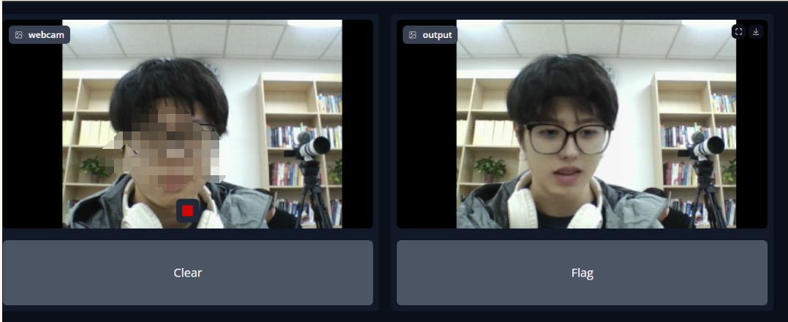

# 北大信科2024ai换脸挑战赛亚军作品
- [推送链接](https://mp.weixin.qq.com/s/TuG7VUBKBkHNbs2RvlMGZw)
- 做了两个版本, faceswap的置信度是0.94, facefusion的置信度是0.76
- 喜提荣耀 magic7 一台
- 冠军是计算机学院老登炸鱼, 不过我们组有我这个大三中登应该也算炸鱼了×
> 置信度为 x 表示荣耀集团的检测程序认为有x的概率是ai换过的假人脸

## 任务描述
实现ai换脸直播. 这一任务算力要求较高, 因此市面上能见到的软件基本采用的是直接找脸贴图. 实现表情捕捉变化, 头部转向则需要高性能显卡. 本项目中**faceswap**属于前者, **facefusion**属于后者.
 
## faceswap
在本地用cpu运行, 尝试性的程序
简单粗暴的找脸贴图, 流畅但是效果逆天

## 配置与使用
参考文件夹内的readme


## facefusion  
在云端linux运行, 在开源的facefusion基础上实现了本地摄像头流数据传输到远程计算机, 需要gpu, 换脸效果非常好, 但视频帧率不高



### 配置
Python推荐3.10
参考官方配置链接 [https://docs.facefusion.io/]
可能遇到诸多cuda源文件缺失的问题, 需要手动安装, 比较繁琐
## 使用
```
python facefusion.py run --skip-download --execution-providers cpu cuda --ui-layouts webcam
```
会在浏览器弹出ui, ui内后续操作即可